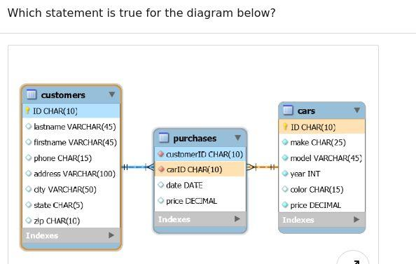

## REST APIs

#### Q1. Which URL pattern s recommended when working with one resource and a collection of resources?
- [ ] `/companies/{id} and/company`
- [ ] `/company/{id} and/companies`
- [ ] `/companies/{id} and/companies`
- [ ] `/company/{id} and/company`

#### Q2. What would you enable to allow a browser on another site to make an AJAX request to your API?
- [ ] `HTTP`
- [ ] `REST`
- [ ] `OPTIONS`
- [ ] `CORS`

#### Q3. What is the underlying goal of all APIs?
- [ ] `to add new technologies to an organization's infrastructure.`
- [ ] `to share features and functionality with other system.`
- [ ] `to move infrastructure to the cloud.`
- [ ] `to appease the latest digital transformation effort.`

#### Q4. Which HTTP verb is normally used to update or create a resource in an API?
- [ ] `SUBMIT`
- [ ] `WRITE`
- [ ] `POST`
- [ ] `CREATE`

#### Q5. Your API resource does no allow deletion, and a client application attempted to delete the resource. What HTTP respose code should you return?
- [ ] `409 Conflict`
- [ ] `400 Bad Request`
- [ ] `406 Not Acceptable`
- [ ] `405 Method Not Allowed`

#### Q6. What is the recommended method and URL pattern for retrieving a specific user?
- [ ] `GET /user/{id}`
- [ ] `GET /users/{id}`
- [ ] `GET /user?id={id}`
- [ ] `GET /users?id={id}`

#### Q7. Which is the most secure method to transmit an API key? 

- [ ] `URL parameter`
- [ ] `Authorization header`
- [ ] `Base64 encoding`
- [ ] `Basic Auth`

#### Q8. When a user attempts to access a record that is not their own, whitch HTTP response code is the most appropriate? 

- [ ] `403`
- [ ] `404`
- [ ] `401`
- [ ] `405`


#### Q9. When you have a subquery inside of the main query, which query is executed first?

- [ ] The subquery is never executed. Only the main query is executed.
- [ ] They are executed at the same time
- [ ] the main query
- [ ] the subquery

#### Q10. If you were building a table schema to store student grades as a letter (A, B, C, D, or F) which column type would be the best choice?

- [ ] ENUM
- [ ] OTEXT
- [ ] VARCHAR
- [ ] LONGTEXT

#### Q11. Which MySQL command shows the structure of a table?

- [ ] INFO table;
- [ ] SHOW table;
- [ ] STRUCTURE table;
- [ ] DESCRIBE table;

#### Q12. Which MySQL command modifies data records in a table?

- [ ] UPDATE
- [ ] MODIFY
- [ ] CHANGE
- [ ] ALTER

#### Q13. In MySQL, queries are always followed by what character?

- [ ] line break
- [ ] colon
- [ ] semicolon
- [ ] period

#### Q14. Which choice is NOT a statement you would use to filter data?

- [ ] GROUP_BY
- [ ] WHERE
- [ ] LIMIT
- [ ] LIKE

#### Q15. What does the following SQL statement return?

`SELECT * FROM Employees WHERE EmployeeName LIKE 'a%'`

- [ ] It records in the Employees table where the value in the EmployeeName column doesn't have an "a".
- [ ] It records in the Employees table where the value in the EmployeeName column starts with "a".
- [ ] It records in the Employees table where the value in the EmployeeName column has an "a".
- [ ] It records in the Employees table where the value in the EmployeeName column ends with "a".

#### Q16. How can you filter duplicate data while retrieving records from a table?

- [ ] DISTINCT
- [ ] WHERE
- [ ] LIMIT
- [ ] AS

#### Q17. What is the difference between DROP and TRUNCATE?

- [ ] They both refer to the same operation of deleting the table completely.
- [ ] They both refer to the same operation of clearing the table, but keeping its definition intact.
- [ ] TRUNCATE deletes table completely, removing its definition as well. DROP clears the table but does not delete the definition.
- [ ] DROP deletes table completely, removing its definition as well. TRUNCATE clears the table but does not delete the definition.

#### Q18. In an efficiently designed relational database, what does every table have?

- [ ] set of triggers
- [ ] sequential id field
- [ ] minimum of three columns
- [ ] primary key

#### Q19. What is the requirement for using a subquery in the SELECT clause?

- [ ] the subquery must use an aggregate function.
- [ ] the subquery must refer to the same table as the main query.
- [ ] the subquery must return a single value.
- [ ] the subquery must return at least one value.

#### Q20.Which statement is true for the diagram below



- [ ] carid is the primary key for purchases
- [ ] carid is the foreign key for cars.carid
- [ ] customerid is the foreign key for customers.id
- [ ] customerid is the primary key for purchases

#### Q21. Which is the correct syntax of an extended insert statement?

- [ ] insert into cars (make, model, year) values ('Ford', 'Mustang', 2002)
      ('Mercedes', 'C', 2003)

- [ ] insert into cars (make, model, year) values ('Ford', 'Mustang', 2002)
      values ('Mercedes', 'C', 2003)

- [ ] insert into cars (make, model, year) extended ('Ford', 'Mustang', 2002),
      ('Mercedes', 'C', 2003)

- [ ] insert into cars (make, model, year) values ('Ford', 'Mustang', 2002),
      ('Mercedes', 'C', 2003)

#### Q22. Management has requested that you build an employee database. You need to include each employee's current position and salary, as well as all prior positions and salaries with the company. You decide to use a one-to-many structure: an employee table with the main information such as name and address, and an employment table with position and salary history. You can use the employeeID field to connect them. What is employment.employeeID an example of?

- [ ] primary key;
- [ ] secondary key;
- [ ] foreign key;
- [ ] alternate key;

#### Q23. Which statement about the `TRUNCATE TABLE` statement is true?

- [ ] It will stop and issue an error when it encounters a row that is referenced by a row in a child table.
- [ ] It always first drops, then re-creates a new table.
- [ ] It deletes rows one by one on tables with foreign key constraints.
- [ ] It does not invoke the `DELETE` triggers associated with the table.

#### Q24. Which of the following is a core module in Node?
 - [ ] webpack
 - [ ] crypto
 - [ ] request
 - [ ] chalk

#### Q25. Can you create an https web server with Node.js?
 - [ ] no, there are no modules supporting it yet
 - [ ] yes, with the https or http2 modules
 - [ ] yes, through the path module
 - [ ] yes, with the http module

#### Q26. How can you use the promise API with a callback-based function like child_process.exec?
 - [ ] new Promise(child_process.exec())
 - [ ] util.promisify(child_process.exec())
 - [ ] util.promisify(child_process.exec)
 - [ ] new Promise(child_process.exec)

#### Q27. Looking at the code below, what does the console show?
```
const http = require('http');
 const hostname = '127.0.0.1'; const port = 3000;
 const server = http.createServer((req, res) => {
  res.statusCode = 200;  res.setHeader("Content-Type", "text/plain");  res.end("Hello World\n");
});
server.listen(port, hostname, () => { console.log(`server running at http://${hostname}:${port}/`); });
```
 - [ ] server running at http://localhost:3000/
 - [ ] server running at port 3000
 - [ ] server running at http://localhost:4000/
 - [ ] server running at http://127.0.0.1:3000/

#### Q28.What is the purpose of the path module?
 - [ ] to provide utilities to play with file and directory paths
 - [ ] to provide utilities to add and remove files
 - [ ] It is a retiring module.
 - [ ] to provide utilities to test files

#### Q29.How do you make an HTTP server object active and listen to requests on certain ports?
 - [ ] server. start
 - [ ] server.activate
 - [ ] server.listen
 - [ ] server. run

#### Q30.How do you start a Node application, if the entry file is index.js?
 - [ ] nodemon start
 - [ ] start index.js
 - [ ] node index.js
 - [ ] node start

### Q31. What can you export with module.exports?
- [ ] only objects.
- [ ] only functions
- [ ] only variables and arrays
- [ ] functions, objects, arrays, or anything you assign to the module
